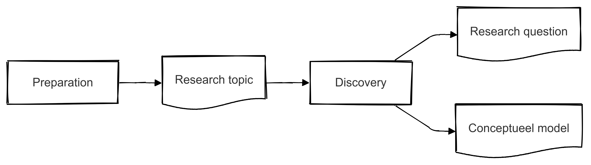

# Fase 2 - Discovery



Nu je vanuit de **Preparation**-fase een duidelijk beeld hebt van de formele eisen en een heldere probleembeschrijving, begint de fase waarin je het vraagstuk verder uitdiept: de **Discovery**. In deze fase ga je op zoek naar achterliggende oorzaken, verzamel je verdiepende inzichten uit de literatuur of de praktijk (bijvoorbeeld via interviews of interne data) en krijg je zicht op mogelijke oplossingsrichtingen. Op basis van deze “ontdekkingen” formuleer je uiteindelijk een scherpe onderzoeksvraag en werk je een conceptueel model uit.

## Kwaliteit onderzoeksvraag

Bij deze fase hoort de reflectievraag: **“Welke kwaliteit van mijn onderzoeksvraag en de uitwerking daarvan past bij de getoetste eindkwalificaties?”**. Door hier bewust bij stil te staan, zorg je dat jouw onderzoek niet alleen voldoet aan de formele eisen, maar ook aantoont dat je over de benodigde competenties beschikt om op HBO-eindniveau af te studeren. Er zijn wat dat betreft twee aspecten die belangrijk zijn:

1. Mate van complexiteit van het vraagstuk
2. De bijdrage aan het leervermogen en verandercapaciteit van de organisatie

## Complexiteit van het vraagstuk en Wicked Problems
Voor je afstudeeronderzoek wordt verwacht dat je een onderzoeksvraag formuleert die niet alleen duidelijk en afgebakend is, maar ook voldoende complexiteit biedt. Dit betekent dat je vraagstuk op HBO-eindniveau moet aansluiten bij de uitdagingen binnen een organisatie en onderbouwd is met relevante theorieën en praktijkobservaties.

Het concept *Wicked Problems* helpt je om te beoordelen of je probleem ‘wicked’ (complex, weinig eenduidige oplossingen en sterk verweven met de omgeving) of eerder ‘tame’ (eenvoudiger, met duidelijke oplossingsrichtingen) is. **Tame vraagstukken** laten zich doorgaans oplossen via bekende methoden en hebben een helder einddoel. Denk bijvoorbeeld aan:  
- *Optimalisatie van een logistiek proces:* “Hoe kunnen we het pick-and-pack-proces in het magazijn met 15% versnellen?”  
- *Verminderen van klantklachten:* “Hoe kunnen we het aantal klachten met 20% terugdringen door procesverbeteringen in de klantenservice?”  

Bij **Wicked Problems** is er geen eenduidige oplossing, spelen verschillende belangen en is de context continu in beweging. Voor een tactisch vraagstuk kan dit er bijvoorbeeld zo uitzien:  
- *Implementeren van Agile-werkwijzen in een traditionele afdeling:* “Hoe kan een afdeling de overstap maken naar Agile-werkwijzen, terwijl andere afdelingen blijven werken met traditionele plannings- en budgetteringscycli?”  
- *Balanceren van kostenbesparingen en servicekwaliteit:* “Hoe kunnen we onze operationele kosten verlagen, zonder dat de klanttevredenheid of interne samenwerkingsprocessen eronder lijden?”  

Hoe ‘wicked’ jouw probleem is, bepaalt voor een groot deel of je onderzoeksvraag de juiste diepgang en complexiteit heeft voor een afstudeeropdracht op HBO-eindniveau. In de onderstaande **video** vind je een uitgebreide toelichting op wat Wicked Problems precies zijn en hoe je hiermee kunt omgaan.

<iframe width="560" height="315" src="https://www.youtube.com/embed/6QaVW_nNMaE?si=v45VMud_a-xvFy2P" title="YouTube video player" frameborder="0" allow="accelerometer; autoplay; clipboard-write; encrypted-media; gyroscope; picture-in-picture; web-share" referrerpolicy="strict-origin-when-cross-origin" allowfullscreen></iframe>

## Leervermogen en verandercapaciteit
Naast de mate waarin een vraagstuk ‘wicked’ of ‘tame’ is, kun je ook kijken naar de bijdrage van mogelijke oplossingen aan het leer- en verandervermogen van de organisatie. Daarvoor maak je gebruik van drie *typen leren*:

```{figure} images/triple-loop.png
---
name: triple-loop
---
Niveau's van leren binnen organisaties. Uit: {cite}`noauthor_triple_2022`
```

|  | Type leren   | Veranderactiviteit | Aanleiding                | Domein     |
|---|--------------|--------------------|---------------------------|------------|
| A | Single loop  | Verbeteren         | Kunnen we het beter doen? | Regels     |
| B | Double loop  | Innoveren          | Waarom doen we het niet anders? | Inzichten  |
| C | Triple loop  | Ontwikkelen        | Bijstellen van de missie? | Principes  |

### Geschikte en minder geschikte voorbeelden

- **Minder geschikt:**  
  1. *Verminderen van doorlooptijden in het salesproces* (Single loop)  
     - Je blijft binnen bestaande kaders en protocollen: je werkt aan procesverbetering, maar vraagt je niet af of het proces of de achterliggende doelen veranderd moeten worden.  
  2. *Verhogen van de klanttevredenheid met 10%* (Single loop)  
     - Een helder doel, maar vooral gericht op het oplossen van ‘symptomen’. Niet op het kritisch herdefiniëren van bijvoorbeeld klantrelaties of bedrijfsstrategie.

- **Geschikt (Double/Triple loop):**  
  1. *Herinrichten van de manier waarop teams hun doelen formuleren en meten* (Double loop)  
     - Je bekijkt niet alleen hoe je efficiënter kunt werken, maar ook of de manier waarop teams doelen stellen en verantwoorden wel past bij de huidige organisatiecontext.  
  2. *Bijstellen van de missie richting circulaire bedrijfsvoering* (Triple loop)  
     - Je bevraagt hier de fundamenten van de organisatie: waarom doen we wat we doen, en moeten we onze kernwaarden/ missie aanpassen om toekomstbestendig te blijven?

**Kortom**, een onderzoeksvraag op HBO-eindniveau reikt verder dan enkel procesoptimalisatie. Probeer vraagstukken te formuleren die (minstens) een *Double loop*-aspect in zich hebben, zodat je laat zien dat je de onderliggende aannames en inzichten ter discussie stelt en bijdraagt aan het leer- en verandervermogen van de organisatie.

:::{admonition} Opdracht 1
Formuleer een aantal passende hoofdvragen en bespreek deze met de opdrachtgever. Bepaal samen de definitieve onderzoeksvraag. Dit mag een nieuwe vraag zijn die nog niet was opgenomen in de oorspronkelijke set.
:::

:::{admonition} Opdracht 2
Stel, nadat je de definitieve onderzoeksvraag hebt vastgesteld, een set van deelvragen op. De set moet zodanig zijn dat als je ze allemaal beantwoordt, je een volledig conclusie kunt opstellen ten behoeve van de beantwoording van de hoofdvraag.

Maak onderscheid naar theoretische, empirische en analytische vragen.
:::

:::{admonition} Opdracht 3
Een conceptueel model is een visuele weergave van *welke* factoren (variabelen) je in je onderzoek wilt betrekken en *hoe* ze elkaar beïnvloeden. In de volgende video leer je aan de hand van een voorbeeld (studie-uren versus examenresultaat) hoe je verschillende typen variabelen (bijvoorbeeld **onafhankelijke**, **afhankelijke**, **moderator**, **mediator** en **controlevariabelen**) kunt herkennen en verwerken in je model. 

<iframe width="560" height="315" src="https://www.youtube.com/embed/MnfRdTCUIsc?si=BwPjOes7XhW5AJJX" title="YouTube video player" frameborder="0" allow="accelerometer; autoplay; clipboard-write; encrypted-media; gyroscope; picture-in-picture; web-share" referrerpolicy="strict-origin-when-cross-origin" allowfullscreen></iframe>

In de opleiding heb je misschien al kennisgemaakt met het *Ishikawa-model*. Daarin noteer je aan de ‘graten’ de mogelijke oorzaken van een probleem (bijvoorbeeld factoren zoals **Mens**, **Methoden**, **Machine**, **Materiaal**, **Milieu** en **Management**). Hoewel een Ishikawa-diagram doorgaans vooral oorzaken van een probleem in kaart brengt, is het een goede oefening om te leren denken in variabelen en hun onderlinge relaties.

```{figure} images/ishikawa-model.svg
---
name: ishikawa-model
---
Voorbeeld Ishikawa model door <a href="https://de.wikipedia.org/wiki/User:FabianLange" class="extiw" title="de:User:FabianLange">FabianLange</a> at <a class="external text" href="https://de.wikipedia.org">de.wikipedia</a> - Translated from <a href="https://en.wikipedia.org/wiki/File:Ursache_Wirkung_Diagramm_allgemein.svg" class="extiw" title="en:File:Ursache Wirkung Diagramm allgemein.svg">en:File:Ursache_Wirkung_Diagramm_allgemein.svg</a>, <a href="http://creativecommons.org/licenses/by-sa/3.0/" title="Creative Commons Attribution-Share Alike 3.0">CC BY-SA 3.0</a>, <a href="https://commons.wikimedia.org/w/index.php?curid=6444290">Link</a>, <a href="https://commons.wikimedia.org/w/index.php?curid=6444290">Koppeling</a>
```

Voor een **conceptueel model** ga je een stap verder:  
1. **Kies de relevante variabelen**: Welke variabelen spelen een rol in jouw vraagstuk? Bijv. “Leiderschapsstijl”, “Teamvaardigheden” en “Productiviteit”.  
2. **Geef verbanden weer**: Hoe hangen deze variabelen volgens jouw hypothese met elkaar samen? Welke factoren beïnvloeden welke uitkomsten?  
3. **Maak het visueel**: Teken pijlen, gebruik blokken of symbolen om oorzaken, gevolgen en mogelijke tussenvariabelen te onderscheiden.

**Voorbeeld**: Stel dat je wil onderzoeken in hoeverre *teamvaardigheden* en *leiderschapsstijl* van invloed zijn op de *productiviteit* in een productieafdeling. In een Ishikawa-achtige opzet zou je het probleem “Lagere productiviteit” rechts zetten (bij de ‘kop’ van de vis), en aan de linkerkant de potentiële oorzaken (bijv. “Gebrek aan kennis”, “Onvoldoende afstemming”, “Gebrekkige coaching door leidinggevende”). Voor een volwaardig conceptueel model zet je deze factoren in aparte variabelenblokken, geef je aan op welke manier ze elkaar beïnvloeden (pijlrichtingen) en koppel je ze aan de verwachte einduitkomst (productiviteit).

**Wat lever je in?**  
- Een **visuele weergave** (bijv. in PowerPoint, Word of een ander tekenprogramma) van jouw conceptueel model.  
- Een **korte toelichting** waarom je deze variabelen kiest en welke relaties je verwacht te vinden.  

Zo krijg je een duidelijk startpunt voor je onderzoek: het model laat zien welke samenhangen je wilt testen of analyseren, en vormt daarmee de basis voor de data die je gaat verzamelen en de analyses die je uitvoert.
:::

:::{seealso} # Workshop onderzoeksvraag en -methodes

Tijdens deze workshop gaan we praktisch aan de slag met het verbeteren van je onderzoeksvraag en het afstemmen van je onderzoeksmethoden. We richten ons op de kwaliteit van je vraagstelling en hoe deze aansluit bij de eindkwalificaties van je opleiding. Door middel van self-assessment en peer review krijg je concrete handvatten om je onderzoek naar een hoger niveau te tillen.

### Programma

| Tijd          | Onderdeel |
|---------------|-----------|
| 00:00-00:15   | Inloop en welkom |
| 00:15-00:30   | Uitleg programma |
| 00:30-00:50   | Instructie kwaliteit vraagstelling (met koppeling naar waardecreatie / complexiteit / relatie eindkwalificaties) |
| 00:50-01:30   | Self-assessment mbv van reflectievragen en koffiepauze |
| 01:30-02:00   | Peer review in studentenkring |
| 02:00-02:30   | Uitleg Fase 3 - Analysis |

### Self-assessment Instructies

* Voor elke eindkwalificatie zijn beoordelingscriteria geformuleerd.
* Beoordeel in hoeverre je onderzoeksvraag en de beoogde aanpak aansluiten bij deze criteria.
* Gebruik de reflectievragen om dieper na te denken over mogelijke verbeteringen.
* Vul alle velden in het formulier zo volledig mogelijk in.
* Klik op de "Bewaar als PDF" knop om een rapport te genereren.

**Gebruik het gegenereerde rapport:**
* ... als basis voor een gesprek met je begeleider over de focus en aanpak van je onderzoek.
* ... om je onderzoeksvraag verder aan te scherpen en te verfijnen.
* ... als onderdeel van je reflectie op je professionele ontwikkeling.

**NB:** De gegevens in dit formulier en de bijbehorende rapportage zijn strikt vertrouwelijk en uitsluitend bestemd voor persoonlijk gebruik. Deze informatie wordt op geen enkele wijze gedeeld met of verzonden naar externe partijen.

[Link](https://hanbedrijfskunde.github.io/scan-onderzoeksvraag/) naar self-assessment tool. 
:::