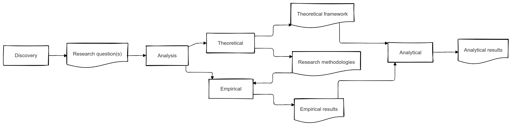

# Fase 3 - Analysis



**Introductie – Analysis**  
In de **Analysis**-fase zet je de stap van je geformuleerde onderzoeksvraag naar een onderbouwde, systematische onderzoeksaanpak. Het schema laat zien hoe je in deze fase zowel je **theoretisch framework** uitwerkt als de keuze maakt voor **empirische** onderzoeksmethoden. Daarna combineer je de inzichten uit de theorie en de praktijk tot een helder overzicht van je onderzoeksresultaten (het blok “Analytical”), zodat je de vraagstukken uit de voorgaande fase (Discovery) kunt beantwoorden.

1. **Volledig, betrouwbaar en valide theoretisch framework**  
   - *Volledigheid:* Ga na of je alle relevante theorieën, modellen en concepten hebt meegenomen. Welke perspectieven of disciplines zijn onmisbaar om jouw onderwerp te begrijpen?  
   - *Betrouwbaarheid:* Baseer je framework op hoogwaardige bronnen (wetenschappelijke artikelen, vakliteratuur) en verifieer claims via meerdere referenties.  
   - *Validiteit:* Check of de gekozen theorieën daadwerkelijk passen bij je onderzoeksvraag. Stel jezelf de vraag: “Geven deze theorieën echt richting aan het beoogde onderzoek, of mis ik belangrijke elementen?”

2. **Keuzes in dataverzameling en verwerking (empirisch onderzoek)**  
   - *Dataverzameling:* Kies een methode die aansluit bij je onderzoeksvraag en de aard van je data (bijv. kwalitatief: interviews, observaties; of kwantitatief: enquêtes, bestaande databestanden).  
   - *Dataverwerking:* Bepaal hoe je ruwe data gaat ordenen en analyseren. Komen statistische technieken of kwalitatieve analysetools (zoals coderen van interviews) het best tot hun recht?  
   - *Triangulatie:* Overweeg het combineren van meerdere bronnen of methodes om de betrouwbaarheid van je resultaten te vergroten (bijv. het vergelijken van enquêteresultaten met observaties in de praktijk).

3. **Optimale compilatie en visualisatie van je onderzoeksresultaten**  
   - *Selecteer de juiste vorm:* Kies tabellen, grafieken, modellen of dashboards die jouw bevindingen het duidelijkst in kaart brengen.  
   - *Focus op de rode draad:* Breng de verbinding tot stand tussen je theoretische kaders en de empirische uitkomsten, zodat de lezer makkelijk ziet hoe jouw conclusie tot stand is gekomen.  
   - *Toegankelijke rapportage:* Gebruik visuele hulpmiddelen (diagrammen, infographics) en zorg voor een logische opbouw, zodat de lezer in één oogopslag de belangrijkste inzichten herkent.

Door in deze fase bewust stil te staan bij de **theoretische basis**, de **empirische methoden** en de **visualisatie** van je gegevens, leg je een stevig fundament voor betrouwbare, valide en praktisch bruikbare resultaten. Zo creëer je een naadloze overgang naar de fase van **Analytical results** en kun je uiteindelijk overtuigend antwoord geven op je onderzoeksvraag.

:::{admonition} Opdracht 1
*Doel:* Leren hoe je wetenschappelijke artikelen kunt gebruiken als inspiratiebron bij het opstellen van je theoretisch kader, het kiezen van geschikte data­verzamelings- en -verwerkingsmethoden en het effectief compileren en visualiseren van je onderzoeksresultaten.

```{figure} images/bron-analyse.webp
---
name: bron-analyse
---
Algemene structuur wetenschappelijk artikel. Uit: {cite}`_structure_nodate`
```

1. **Selecteer drie relevante wetenschappelijke artikelen**  
   - Zorg dat ze inhoudelijk aansluiten op jouw (beoogde) onderzoeksthema.  
   - Leg in twee zinnen uit waarom je deze artikelen kiest.

2. **Analyseer het theoretisch kader in elk artikel**  
   - Waar haalt de auteur de theorie vandaan (welke bestaande modellen, concepten of definities)?  
   - Welke begrippen of benaderingen zou je kunnen hergebruiken in jouw eigen theoretisch kader?

3. **Onderzoek de dataverzameling en -verwerking**  
   - Welke methoden hebben de auteurs ingezet (kwantitatief, kwalitatief, mixed methods)?  
   - Hoe hebben ze de data verwerkt (statistische analyses, thematische analyse, etc.)?  
   - Reflecteer kort op welke manier(en) deze aanpak voor jouw onderzoek toepasbaar is (of juist niet).

4. **Bestudeer de compilatie en visualisatie van de onderzoeksresultaten**  
   - In welke vorm presenteren de auteurs hun resultaten (tabellen, grafieken, modellen)?  
   - Wat valt op aan de manier waarop zij de kernboodschap duidelijk maken?  
   - Schrijf kort op welke visualisatietechnieken je zou kunnen overnemen voor je eigen onderzoek.

5. **Reflectie**  
   - Vat in ongeveer één alinea samen welke **inzichten** en **ideeën** je uit deze artikelen meeneemt voor jouw eigen onderzoek. Denk daarbij aan het theoretisch kader, de gekozen methoden én de wijze van presenteren.

Lever je antwoorden per artikel in een kort verslag in. Zorg dat duidelijk wordt hoe jouw onderzoek profiteert van de geleerde lessen. Zo leer je systematisch te kijken hoe andere onderzoekers te werk gaan en hoe je hun aanpak en inzichten kunt toepassen in je eigen project.
:::

